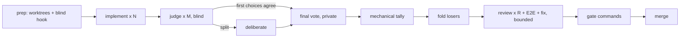

# magi

**A blind multi-agent implementation competition, as a CLI.**

Three agents solve the same task in isolation. Three judges rank the results
without knowing who wrote what. If they disagree, they argue, and then vote
privately. The winner survives a review + real-machine verification loop before
anything is allowed to merge.

The premise is that one agent's *first choice of approach* is the part no amount
of reviewing fixes. Review a bad design carefully and you get a well-polished
bad design. So magi does not review one implementation — it holds an election
between several, and only then reviews.



## What makes the judging blind

A judge that knows which model wrote a candidate stops grading the patch and
starts voting on the model's reputation. Four mechanisms prevent that:

| Mechanism | Where |
|---|---|
| Candidates are `A`/`B`/`C` by seeded shuffle; each judge gets its own presentation order | `src/blind.rs` |
| Branches are named after the **label** (`magi/<run>/B`), so a judge can `git show` a candidate without learning its author | `src/run.rs` |
| A per-worktree `commit-msg` hook deletes `Co-Authored-By:` / `Generated with …` before they can land | `src/blind.rs`, `src/git.rs` |
| The same trailers are stripped again at presentation time, and uncommitted work is rescued under a neutral identity | `src/blind.rs`, `src/git.rs` |

The facilitator is **code, not an agent**. magi assigns the labels, relays the
transcript, and collects the final votes one-to-one. A moderator that never
learns an author cannot leak one, and there is no seat for a model to be
persuaded out of neutrality.

Two more consequences of that design:

- **Seats, not agents.** Conversations are keyed by seat (`impl-B`, `judge-2`),
  never by agent id. The model that wrote candidate B and the model sitting as
  judge 3 may be the same model, and it still cannot recognise its own work,
  because the judge seat's conversation never contained the implementation.
- **Private final votes.** After deliberation, each judge is asked separately,
  told that nobody sees the answer, and no running tally exists to drift toward.

Vendor names appearing in the *patch body* are a different problem: redacting
them would corrupt the artifact under judgement. magi scans for them, records
what it found, and `blind.on_leak` decides (`warn` by default, or `redact` /
`fail`).

## Conversation continuity

Deliberation and the review loop are multi-turn. Re-sending three patches on
every turn is both expensive and worse — a judge should argue from what it
already said. magi therefore keeps one CLI conversation per seat:

| CLI | open | resume | notes |
|---|---|---|---|
| `claude` | `--session-id <uuid>` (magi mints it) | `--resume <uuid>` | addressable before the first turn |
| `opencode` | `run --format json` reports `sessionID` | `run -s <id>` | id captured from the event stream |
| `agy` (Antigravity) | `--output-format json` reports `conversation_id` | `--conversation <id>` | `--print-timeout` is raised to the node budget |

When a seat has no live conversation — sessions disabled, or a first turn that
never reported an id — magi re-sends the full context instead of letting the
agent argue from memory it does not have. Set `graph.sessions = false` to force
that everywhere.

Gemini CLI is deliberately **not** supported: Google retired the standalone
client for individual accounts in favour of Antigravity, so the adapter would be
dead code. `kind = "command"` covers anything else.

## Install

```sh
cargo install magi-cli
```

magi drives *subscription CLIs*, not API keys: `claude`, `opencode`, `agy`, or
any command you point it at. It spends your existing plan and nothing else.

## Use

```sh
magi init                     # write a starter magi.toml
magi doctor                   # check CLIs, repo, roster, seat assignment
magi run "add retries to the uploader"
magi run --file task.md
magi run --issue 42           # task from a GitHub issue, via gh
magi run --resume 20260830-153012-a1b2
magi show                     # full report for the latest run
magi list
magi stats                    # win rates, reviewer precision, E2E yield
magi fold --all               # remove a run's worktrees and branches
magi self-update              # or let the background check tell you
```

A run refuses to start on a dirty tree: candidates branch off `HEAD`, and
uncommitted work would be silently excluded from the competition.

## Configuration

Config files are TOML rendered by
[teravars](https://github.com/yukimemi/teravars), and they **deep-merge in
increasing precedence**:

```text
<config_dir>/magi/config.toml   <   <repo>/.magi/config.toml   <   <repo>/magi.toml
```

That split exists because the roster is a *machine* fact — which CLIs and which
plans you pay for — while the gate is a *repository* fact (`cargo make check`
here, `pnpm test` there). Declare the roster once per machine and let each repo
state only what is its own. `--config <path>` uses that single file instead.
With no config at all, magi builds a roster from the agent CLIs on `PATH`.

Inside a config file you have `[vars]`, `{{ env.NAME }}`, `{{ system.os }}`,
`{{ repo }}`, `{{ repo_name }}`, and `include = [...]`:

```toml
[vars]
cache = "{{ env.MAGI_CACHE | default(value='/tmp') }}"

[verify]
gate = ["CARGO_TARGET_DIR={{ vars.cache }}/magi-target cargo make check"]
```

Two traps: the whole file is a template, **comments included**, and teravars
renders the raw text before TOML unescaping — so use single quotes inside the
braces (`value='/tmp'`, never `value=\"/tmp\"`).

The full surface:

```toml
[[agents]]
id = "opus"
kind = "claude"        # claude | opencode | antigravity | command
model = "opus"

[[agents]]
id = "sonnet"
kind = "claude"
model = "sonnet"

[[agents]]
id = "oc"
kind = "opencode"

# Leave a role empty to rotate through the roster. The judge seats are rotated
# by one, so judge i is never the author of candidate i.
[roles]
implementers = ["opus", "sonnet", "oc"]
judges = ["sonnet", "oc", "opus"]
reviewers = ["opus", "oc"]
# fixer defaults to the winner's own author, continuing its own conversation.

[graph]
candidates = 3
judges = 3
deliberate_rounds = 1
reviewers = 2
review_rounds = 6
max_parallel = 4
language = "en"          # prose language for the agents; "ja" etc.
sessions = true
timeout_implement = 3600
worktree_root = "~/wt/magi"   # optional

[blind]
commit_msg_hook = true
on_leak = "warn"         # warn | redact | fail
# seed = 42              # reproduce a run's label assignment

[verify]
# Run once per review round in the winner's worktree; failures are fed back to
# the fixer. This is the "real machine" leg of the review.
e2e = ["cargo test --locked"]
# Final gate. Every command must exit 0 before a merge is attempted.
gate = ["cargo make check"]

[merge]
mode = "none"            # none | local | pr

[update]
mode = "notify"          # off | notify | install
# interval = "24h"
```

`mode = "none"` is the default on purpose: magi prints the merge command and
stops. It does not touch your base branch unless you ask it to.

An arbitrary agent, or a deterministic stub for testing:

```toml
[[agents]]
id = "mock"
kind = "command"
command = ["sh", "./mock-agent.sh"]   # {prompt_file} {cwd} {label} {session}
```

`command` agents also receive `MAGI_SEAT`, `MAGI_TURN`, `MAGI_PROMPT_FILE` and
`MAGI_ALLOW_WRITE` in the environment.

## The review loop

The winner — and only the winner — enters a bounded loop:

1. Each reviewer gets its **own detached worktree** pinned at the exact commit
   under review, so no reviewer can perturb the tree and the fixer never races
   one.
2. `verify.e2e` runs in the winner's worktree. Its output is fed to the fixer.
3. The fixer addresses the blocking findings, or **rejects one with an
   argument** — a rejected finding with a checkable reason is a correct outcome,
   and magi records it as such.
4. Repeat until no blocking finding remains and verification is green, or
   `review_rounds` is exhausted (`blocked`). A round where the fixer produces no
   commit stops the loop instead of spinning on an unchanged tree.

Finding ids (`R2-1-3`) are assigned by magi, never by the agent, because the
fixer's adoption report is keyed by them — that is what makes reviewer precision
measurable rather than self-reported.

## Statistics

`magi stats` aggregates every run on disk:

- **implementation** — win rate per agent, and how often an agent produced
  nothing at all.
- **review** — findings per round, precision (adopted / submitted), and unique
  find rate (findings no other reviewer in the same round raised, matched by
  normalised title or same file within five lines).
- **verification** — how often E2E failed while every static review was clean:
  the runtime defects only execution found.

These are a by-product, not a benchmark. Seats rotate, the task distribution is
whatever you happened to ask for, and an agent that drew harder tasks looks
worse. Read them as *relative performance on your workload*.

## Where a run spends its time

Measured on a real run (2 candidates, 2 judges, 1 reviewer, 219 s wall):

| node | wall | spent by |
|---|---|---|
| prep | 2.8 s | git: four worktrees plus the hook |
| implement ×2, parallel | 93.0 s | the slower agent (69 s / 92 s) |
| judge ×2, parallel | 84.6 s | agent latency |
| vote | 9.2 s | agent latency |
| tally / fold / merge | 0.5 s | magi |
| review | 26.1 s | agent latency |
| e2e + gate | 1.6 s | your commands |

magi's own compute was 3.3 s of 219 s. Everything else is the agent CLIs, so the
three levers that matter are:

- **`max_parallel`** — agent processes are network-bound, so raising it is close
  to free. Implement, judge and review run as parallel waves.
- **`deliberate_rounds`** — deliberation is *sequential* by design, because a
  turn has to be able to answer the one before it. Each round costs
  `judges × turn latency`. Set it to `0` to skip arguing and go straight to the
  private vote.
- **`verify.e2e` on a compiled language** — each worktree would otherwise build
  from scratch, which dwarfs every agent call. `verify` commands run through
  `sh -c`, so share the cache:

  ```toml
  e2e = ["CARGO_TARGET_DIR=${TMPDIR:-/tmp}/magi-target cargo test --locked"]
  ```

  Only the winner's worktree runs them, one at a time, so nothing contends on
  cargo's lock.


### Disk

`candidates + judges + reviewers` worktrees exist at peak (8 with the defaults).
Judge worktrees are removed as soon as the tally lands, and `magi fold` clears
the rest. On a large repository that is real disk; lower `judges` or point
`worktree_root` at a roomier volume.

State lives in `<data_local>/magi/runs/<id>/` — `run.json` plus every prompt and
raw agent reply under `artifacts/`. `MAGI_HOME` moves it.

## Prior art

The graph is the one described in
[コードを書くのもレビューも大好きだったのについに全部AIの仕事になった](https://zenn.dev/ttlg/articles/4077fffd458d61)
(yota, AGI Cockpit), reimplemented as a standalone CLI: three implementations,
blind judges, deliberation on a split, private final votes, double review plus
E2E behind a test gate.

## License

MIT
