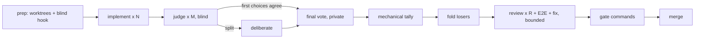

<p align="center">
  <picture>
    <source media="(prefers-color-scheme: dark)" srcset="https://raw.githubusercontent.com/yukimemi/magi/main/assets/logo-dark.svg">
    
  </picture>
</p>

# magi

**A blind multi-agent implementation competition, as a CLI.**

Three agents solve the same task in isolation. Three judges rank the results
without knowing who wrote what. If they disagree, they argue, and then vote
privately. The winner survives a review + real-machine verification loop before
anything is allowed to merge.

The premise is that one agent's *first choice of approach* is the part no amount
of reviewing fixes. Review a bad design carefully and you get a well-polished
bad design. So magi does not review one implementation — it holds an election
between several, and only then reviews.



## What makes the judging blind

A judge that knows which model wrote a candidate stops grading the patch and
starts voting on the model's reputation. Four mechanisms prevent that:

| Mechanism | Where |
|---|---|
| Candidates are `A`/`B`/`C` by seeded shuffle; each judge gets its own presentation order | `src/blind.rs` |
| Branches are named after the **label** (`magi/<run>/B`), so a judge can `git show` a candidate without learning its author | `src/run.rs` |
| A per-worktree `commit-msg` hook deletes `Co-Authored-By:` / `Generated with …` before they can land | `src/blind.rs`, `src/git.rs` |
| The same trailers are stripped again at presentation time, and uncommitted work is rescued under a neutral identity | `src/blind.rs`, `src/git.rs` |

The facilitator is **code, not an agent**. magi assigns the labels, relays the
transcript, and collects the final votes one-to-one. A moderator that never
learns an author cannot leak one, and there is no seat for a model to be
persuaded out of neutrality.

Two more consequences of that design:

- **Seats, not agents.** Conversations are keyed by seat (`impl-B`, `judge-2`),
  never by agent id. The model that wrote candidate B and the model sitting as
  judge 3 may be the same model, and it still cannot recognise its own work,
  because the judge seat's conversation never contained the implementation.
- **Private final votes.** After deliberation, each judge is asked separately,
  told that nobody sees the answer, and no running tally exists to drift toward.

Vendor names appearing in the *patch body* are a different problem: redacting
them would corrupt the artifact under judgement. magi scans for them, records
what it found, and `blind.on_leak` decides (`warn` by default, or `redact` /
`fail`).

## Conversation continuity

Deliberation and the review loop are multi-turn. Re-sending three patches on
every turn is both expensive and worse — a judge should argue from what it
already said. magi therefore keeps one CLI conversation per seat:

| CLI | open | resume | notes |
|---|---|---|---|
| `claude` | `--session-id <uuid>` (magi mints it) | `--resume <uuid>` | addressable before the first turn |
| `opencode` | `run --format json` reports `sessionID` | `run -s <id>` | id captured from the event stream |
| `agy` (Antigravity) | `--output-format json` reports `conversation_id` | `--conversation <id>` | `--print-timeout` is raised to the node budget |

When a seat has no live conversation — sessions disabled, or a first turn that
never reported an id — magi re-sends the full context instead of letting the
agent argue from memory it does not have. Set `graph.sessions = false` to force
that everywhere.

Gemini CLI is deliberately **not** supported: Google retired the standalone
client for individual accounts in favour of Antigravity, so the adapter would be
dead code. `kind = "command"` covers anything else.

## Install

```sh
cargo install magi-cli
```

magi drives *subscription CLIs*, not API keys: `claude`, `opencode`, `agy`, or
any command you point it at. It spends your existing plan and nothing else.

## Use

```sh
magi                          # the observation deck (see below)
magi init                     # write a starter magi.toml
magi doctor                   # check CLIs, repo, roster, seat assignment
magi run "add retries to the uploader"
magi run --file task.md
magi run --issue 42           # task from a GitHub issue, via gh
magi run --resume 20260830-153012-a1b2
magi show                     # full report for the latest run
magi list
magi stats                    # win rates, reviewer precision, E2E yield
magi fold --all               # remove a run's worktrees and branches
magi self-update              # or let the background check tell you
magi task add "port the retry logic to the uploader"
magi task list                # the backlog `magi serve` drains
magi task done <id>           # work that landed some other way
magi serve                    # run the queue unattended
magi web                      # the phone UI, over Tailscale
magi plan "rework the config loader"   # interview, then file the task it writes
magi answer                   # what an agent is waiting to hear from you
```

`magi run` starts spending money, so an instruction whose first word names a
subcommand is refused as a probable typo: there is no `magi run show`, and
without the guard `magi run show 3cbf` opens worktrees and pays agents to
implement the sentence "show 3cbf". Write `magi run -- show 3cbf` when that is
genuinely the task.

A run branches off the **base branch's tip**, not off your working copy, so it
starts whether or not you have uncommitted work — and that work is not part of
the competition. `magi serve` would otherwise decline every task for as long as
you had something in progress, which is most of the time. magi says so in the
log when the tree is dirty, because someone watching a candidate fail to use a
change they just made deserves to know why.

## The observation deck

Bare `magi` (or `magi tui`) opens every run in one screen, refreshed from disk
once a second, so a competition can be watched instead of polled:

```text
 magi   2 runs  1 active  1 done  0 attention  |  filter: all
┌ runs ─────────────────────────┐┌ report ────────────────────────────────┐
│> reviewing   a1b2  add retries ││magi run 20260830-153012-a1b2  reviewing│
│  ready       50f1  fix the …   ││  candidates                            │
│                               ││  A  opus    3 files, 2 commits  <- winner
└───────────────────────────────┘└────────────────────────────────────────┘
 j/k move  Tab pane  J/K scroll  a filter  r refresh  o open dir  ? help  q quit
```

| key | |
|---|---|
| `j` `k` `↓` `↑` | move in the focused pane |
| `Tab` | switch pane (runs / report) |
| `J` `K`, `PageDown` `PageUp` | scroll the report |
| `g` `G` | newest / oldest run |
| `a` | cycle filter: all → active → attention → done |
| `r` | refresh now |
| `o` | open the run's directory in the OS file manager |
| `?` | help |
| `q` `Esc` `Ctrl-C` | quit |

It is **read-only on purpose**: the runs are the record of what the agents did,
and a keystroke that could rewrite one has no business being a `j` away from
browsing. Cleanup stays in `magi fold`.

Piped or in CI, bare `magi` does not raise an alternate screen — it prints the
latest run's report instead, so `magi | head` behaves.

## Running unattended

A competition takes tens of minutes, almost all of it agent latency. Sitting in
front of that is the wrong job for a human, so magi has a queue and a loop that
drains it:

```sh
magi task add "port the retry logic to the uploader"
magi task add --file tasks/rework-config.md --priority 5
magi task add --issue 42
magi serve                    # take the next task, run the graph, repeat
```

One task is one JSON file under `<data_local>/magi/queue`, so the backlog is
readable, editable, and greppable with the tools already on the machine, and a
daemon killed mid-run leaves a queue the next one picks up.

`magi serve` runs **one competition at a time** on purpose. The graph is already
parallel inside — candidates times judges — and two graphs at once doubles the
burn on the agent-CLI quota that is the real constraint.

| verb | |
|---|---|
| `magi task add` | file work; text, `--file`, `--issue`, or stdin |
| `magi task list` | the backlog, newest first |
| `magi task show <id>` | one task in full |
| `magi task hold` / `release` | park work, or give it a real second chance |
| `magi task done` | mark it finished, for work that landed by a route the loop did not see |
| `magi task rm` | delete it |

`done` and `release` are one keystroke apart and do opposite things. Reach for
`done` when the work is already in `main` — merged by hand, or merged by a run
that recorded its own merge as a failure. `release` would put the task back in
line and pay for the whole competition again to redo it.

### Agents file their own work

`magi task add` is not a human-only command. Every agent the graph spawns gets
`MAGI_RUN` and `MAGI_NODE` in its environment, so an implementer that notices
something worth doing but out of scope can file it:

```sh
magi task add "the config loader re-reads the file on every lookup"
```

The task records `implement@a1b2` as its source rather than `human`. That
attribution comes from the environment `agent::invoke` sets, which no flag can
forge by accident — which is what makes "most of the backlog was filed by
agents" a measurement rather than a claim. It is also the whole point: the CLI
is the operating surface, and the agents are its users as much as you are.

### Bounded on purpose

An autonomous loop that retries forever is a way to spend money on a task that
cannot succeed. Every attempt is counted; a task that burns its attempts becomes
`held` and waits for a person, not for another agent.

A **quota stall is refunded**. When the agent CLIs hit their rate limit the
judging panel collapses, the run stops as `stalled`, and the task goes back in
line *without* spending an attempt — a quota window closing at 4am must not
leave a backlog of tasks that were never actually judged.

Only a rate limit earns that refund. A judging panel can also collapse because
the judges answered with the wrong shape — which is ordinary flakiness, can
recur on every attempt, and is charged to the task, so the attempt counter
still bounds it. Refunding *that* would take the bound off the loop entirely
and pay for a fresh implement wave every time.

## Working out what to build, with someone

A task file without completion criteria produces a competition whose candidates
cannot be compared, and you find out forty minutes and several dollars later.
So the first step is a conversation:

```sh
magi plan "rework the config loader"
```

magi hands your terminal to a leader agent's own interface — its UI, its
history, its keybindings — and takes it back when the interview is over to
check the draft and queue it. It does **not** reimplement a chat window; the
agent CLIs are better at that than magi will ever be.

What magi does own is the shape of the result. A draft with no completion
criteria is refused, with every problem listed at once, and **the draft is kept
on disk and named in the error** — a twenty-minute interview is never lost to a
validation failure.

## Panels: the agent formats its own confirmation screen

One line of prose is not enough to decide anything. So an agent can hand over
a page it wrote itself:

```sh
magi ask --summary "Which cache key shape?" \
         --choice "u64 hash" --choice "string key" \
         --panel panel.html --asset before.png
```

The panel is the agent's own HTML and CSS — a diffstat table, a coloured diff,
a screenshot — rendered on your phone under the question. Attachments are
copied into the question, so a panel still renders after `magi fold` has
deleted the worktree it was written in.

### Why this is safe

Rendering someone else's HTML in your browser is the thing this UI otherwise
refuses to do: nothing from the API is ever put into `innerHTML`, and even an
href out of a run record goes through a scheme check. A panel is the exception,
and it is only acceptable because of three things together:

- The frame is `<iframe sandbox>` **with no tokens at all**. No JavaScript
  runs. It cannot reach the page around it, your cookies, or `localStorage`.
  There is one function in the client that builds it and a comment forbidding
  anyone from adding `allow-scripts`.
- The panel is served under a **strict CSP**:
  `default-src 'none'; img-src 'self' data:; style-src 'unsafe-inline'; …`.
  Inline CSS is allowed, because formatting is the point. **Everything that
  reaches the network is denied**, so a panel cannot phone home through a
  remote image or a beacon — verified with the browser's own violation log.
- Assets come from magi, by bare filename, from that question's own directory.
  The name must match `^[A-Za-z0-9][A-Za-z0-9._-]{0,63}$`, is validated on the
  way in and again on the way out, and an `.svg` is served
  `Content-Disposition: attachment` so it can only ever be an ``.

A panel that will not load says so and leaves the choices usable: you still
have to be able to answer.

## Approving a merge

With `land_approval` on — the default whenever `land` is on — magi asks before
it merges, and the question carries a panel with the whole case: the diffstat
as a table, the diff itself with a `+`/`-` gutter so it reads without colour,
the checks, the review comments that were addressed, the commits being squashed
and **the subject the merge will use**, because you are approving that too.

The diffstat comes from `git diff --numstat`, not `--stat`: the `+++---` bar in
`--stat` is scaled to terminal width, and fabricated numbers have no business
in an irreversible decision.

**Silence is a hold.** An unanswered approval never merges, and neither does
anything other than the word `merge`.

## Planning from a phone

`magi plan` hands your terminal to an agent CLI, which a browser cannot do. So
the web UI runs the same interview as a **turn-based conversation**: your
message, one headless agent turn, repeat. It is not a second implementation of
the interview — it is the same briefing, the same `TASK_FILE_SPEC`, and the
same validator, reached a different way, and it ends the same way: a task file
in the queue.

Each turn resumes the CLI's own conversation (`claude -p --resume`,
`opencode run -s`, `agy --conversation`), so a turn sends only your new
sentence rather than replaying the transcript and paying for it again. Your
message is written to disk **before** the agent is invoked, so a quota window
or a crash cannot lose something you typed. The interviewer runs with writes
disabled: a planner that had already edited the repository would make the
candidates' diffs unjudgeable.

When the agent has written a draft you get it as the task file it is, with the
problems listed if it is not usable yet, and one button to file it.

## When an agent needs you

```sh
magi ask --summary "Which storage backend?" --choice SQLite --choice Redis
```

That is the command an *agent* runs, mid-task, instead of guessing. It blocks;
the question appears on your phone with the choices as buttons; the answer goes
back on the agent's stdout. From a terminal, `magi answer` does the same job.

A question is attributed to the seat that asked it — `run 9fb7 · node implement
· seat impl-A` — because "who wants to know" is the first thing you need in
order to answer. Runs blocked on an unanswered question are marked as such in
the runs list: a parked run consumes nothing and progresses never, so being
noticed is the only thing that moves it.

Set `[notify] command` to be told out of band:

```toml
[notify]
command = ["ntfy", "publish", "magi", "{summary} — {url}"]
```

`{summary}`, `{run}` and `{url}` are substituted into the argv, never into a
shell string, so a question containing `; rm -rf` stays one argument. `{url}`
comes from `MAGI_WEB_URL`, which `magi web` prints at startup — a run cannot
discover the address another process bound. A notification that fails is logged
and ignored: a broken webhook is not a reason to throw away an implementation.

## Landing it

With `merge = "pr"`, magi opens the pull request and then keeps going: watches
the checks, reads the review comments — human and bot — runs a fix round when
either is unhappy, pushes, and asks you to merge when they are happy.

```toml
[graph]
land = true            # default: take over the watching
land_approval = true   # default: never merge without being asked
land_rounds = 4
```

**Both are on by default, and that pair is the point.** `land` takes over the
watching an operator would otherwise do by hand; `land_approval` keeps the
irreversible step a human decision. An unattended merge needs both flipped, and
that has to be chosen deliberately twice.

It **never force-merges**: out of rounds leaves the pull request open with a
comment saying what is still failing, and `checks: unknown` — no signal at all —
never merges either.

A pull request opened a second ago has no checks yet, and "not yet" is
indistinguishable from "this repository has no CI". So magi waits three minutes
for the checks to appear before believing there are none. Whatever it then
decides, a run that got as far as opening a pull request is never re-competed:
the task is **held** with the reason, because the implementation exists and is
waiting on CI or on you. Retrying would race a second branch against your open
pull request and spend the whole competition budget again.

## Project conventions in the prompts

```toml
[prompts]
all = "This repo uses jj, not git. Never run `git commit`."
review = "Ignore formatting; a hook owns it."
```

Appended to the node prompts, under a heading of their own — **never merged
into them**. The built-in prompts carry the invariants the competition rests
on: a judging prompt names no authors, structured answers arrive as one fenced
`json` block, judges are told not to speculate about authorship. A config that
could *replace* a prompt would let a typo un-blind the panel, and the symptom
would be "the judges got worse" rather than an error.

Repository-wide context belongs in `AGENTS.md`, which every agent already reads
from the checkout. These fields are for what a *magi node* needs to know and a
repository file cannot say.

## The phone UI

```sh
magi web                      # http://100.x.y.z:7878
```

The same runs, the same queue, from a phone. `--bind auto` (the default) finds
the machine's Tailscale address and serves there; with no Tailscale it falls
back to loopback and says so.

**There is no authentication. The tailnet is the security boundary.** That is a
deliberate choice for a single-operator tool on a private network, and it is the
reason the default bind is not `0.0.0.0`.

It is still one binary. The interface is three files compiled in with
`include_str!` — no JavaScript toolchain, no CDN, no remote font, nothing
fetched at runtime. `cargo install magi-cli` gives you the phone UI too.

You can watch runs, read the full report, browse the queue, hold and release
tasks, file new work from the compose form, and delete a task or a finished run
that is no longer wanted. Deletion is guarded rather than hidden: a task the
daemon is holding a claim on, and a run a live daemon is working on right now,
are refused with the reason. So is any run whose candidate worktrees have not
been folded — that is the guard that keeps "delete" meaning "remove a record"
rather than "throw away a worktree". A run left unfinished by a killed daemon
is a leftover, not work in progress, and can be removed once it is folded.

**The loop runs inside `magi web`.** `GET /api/loop` reports whether it is
running and who owns it; `POST /api/loop {"running": true|false}` starts and
stops it. Only the process serving the page can control its own loop — a loop
started elsewhere is reported with the owning pid and both calls are refused,
because a button that silently did nothing would be worse than a refusal, and
two loops on one queue race for the same claims and bill the agent quota twice.

Answering an interview turn returns **202** immediately and runs the agent in
the background: a turn takes twenty to ninety seconds, and a phone that walks
behind a wall while the request is open loses the answer the server had already
produced. The operator's turn is persisted before the response returns, so the
transcript is never missing what you actually said.

Every list is ordered by creation, never by last activity. A list that reorders
itself while you are reading it moves the row out from under your thumb.

## Configuration

Config files are TOML rendered by
[teravars](https://github.com/yukimemi/teravars), and they **deep-merge in
increasing precedence**:

```text
<config_dir>/magi/config.toml   <   <repo>/.magi/config.toml   <   <repo>/magi.toml
```

That split exists because the roster is a *machine* fact — which CLIs and which
plans you pay for — while the gate is a *repository* fact (`cargo make check`
here, `pnpm test` there). Declare the roster once per machine and let each repo
state only what is its own. `--config <path>` uses that single file instead.
With no config at all, magi builds a roster from the agent CLIs on `PATH`.

Inside a config file you have `[vars]`, `{{ env.NAME }}`, `{{ system.os }}`,
`{{ repo }}`, `{{ repo_name }}`, and `include = [...]`:

```toml
[vars]
cache = "{{ env.MAGI_CACHE | default(value='/tmp') }}"

[verify]
gate = ["CARGO_TARGET_DIR={{ vars.cache }}/magi-target cargo make check"]
```

Two traps: the whole file is a template, **comments included**, and teravars
renders the raw text before TOML unescaping — so use single quotes inside the
braces (`value='/tmp'`, never `value=\"/tmp\"`).

**Tables merge; arrays do not.** teravars appends arrays when it merges layers,
which is wrong for every array magi has: `implementers` is an ordered list of
seats, `verify.gate` is the commands to run, `notify.command` is an argv.
Concatenating two of those produces something nobody wrote — three
implementers from a machine's two and a repository's one, or an argv of
`["ntfy", "publish", "curl", "-X"]`.

So magi refuses it. Declare any given array in **exactly one layer**: either
the machine states the roster and repositories override only scalars, or a
repository states its own. Naming the same array in two layers is an error that
names both files, rather than a roster you did not ask for and are paying for.
`magi doctor` prints what actually resolved.

It also names the states nothing will move on its own: tasks **held** for a
person, and tasks left **running** by a daemon that is no longer alive. The
second is the one worth having a line for — the loop only ever offers itself
runnable tasks, and `running` is not one, so a competition interrupted by a
killed daemon leaves its task sitting there forever while the summary counts
it as work in progress.

The full surface:

```toml
[[agents]]
id = "opus"
kind = "claude"        # claude | opencode | antigravity | command
model = "opus"

[[agents]]
id = "sonnet"
kind = "claude"
model = "sonnet"

[[agents]]
id = "oc"
kind = "opencode"

# Leave a role empty to rotate through the roster. The judge seats are rotated
# by one, so judge i is never the author of candidate i.
[roles]
implementers = ["opus", "sonnet", "oc"]
judges = ["sonnet", "oc", "opus"]
reviewers = ["opus", "oc"]
# fixer defaults to the winner's own author, continuing its own conversation.

[graph]
candidates = 3
judges = 3
deliberate_rounds = 1
reviewers = 2
review_rounds = 6
max_parallel = 4
language = "en"          # prose language for the agents; "ja" etc.
sessions = true
timeout_implement = 3600
# A re-ask that only has to restate an answer the seat already worked out gets
# a quarter of these budgets, not the whole one again.
worktree_root = "~/wt/magi"   # optional

[blind]
commit_msg_hook = true
on_leak = "warn"         # warn | redact | fail
# seed = 42              # reproduce a run's label assignment

[verify]
# Run once per review round in the winner's worktree; failures are fed back to
# the fixer. This is the "real machine" leg of the review.
e2e = ["cargo test --locked"]
# Final gate. Every command must exit 0 before a merge is attempted.
gate = ["cargo make check"]

[merge]
mode = "none"            # none | local | pr

[update]
mode = "notify"          # off | notify | install
# interval = "24h"
```

`mode = "none"` is the default on purpose: magi prints the merge command and
stops. It does not touch your base branch unless you ask it to.

An arbitrary agent, or a deterministic stub for testing:

```toml
[[agents]]
id = "mock"
kind = "command"
command = ["sh", "./mock-agent.sh"]   # {prompt_file} {cwd} {label} {session}
```

`command` agents also receive `MAGI_SEAT`, `MAGI_TURN`, `MAGI_PROMPT_FILE` and
`MAGI_ALLOW_WRITE` in the environment.

## The review loop

The winner — and only the winner — enters a bounded loop:

1. Each reviewer gets its **own detached worktree** pinned at the exact commit
   under review, so no reviewer can perturb the tree and the fixer never races
   one.
2. `verify.e2e` runs in the winner's worktree. Its output is fed to the fixer.
3. The fixer addresses the blocking findings, or **rejects one with an
   argument** — a rejected finding with a checkable reason is a correct outcome,
   and magi records it as such.
4. Repeat until no blocking finding remains and verification is green, or
   `review_rounds` is exhausted (`blocked`). A round where the fixer produces no
   commit stops the loop instead of spinning on an unchanged tree.

Finding ids (`R2-1-3`) are assigned by magi, never by the agent, because the
fixer's adoption report is keyed by them — that is what makes reviewer precision
measurable rather than self-reported.

## Statistics

`magi stats` aggregates every run on disk:

- **implementation** — win rate per agent, and how often an agent produced
  nothing at all.
- **review** — findings per round, precision (adopted / submitted), and unique
  find rate (findings no other reviewer in the same round raised, matched by
  normalised title or same file within five lines).
- **verification** — how often E2E failed while every static review was clean:
  the runtime defects only execution found.

These are a by-product, not a benchmark. Seats rotate, the task distribution is
whatever you happened to ask for, and an agent that drew harder tasks looks
worse. Read them as *relative performance on your workload*.

## Where a run spends its time

Measured on a real run (2 candidates, 2 judges, 1 reviewer, 219 s wall):

| node | wall | spent by |
|---|---|---|
| prep | 2.8 s | git: four worktrees plus the hook |
| implement ×2, parallel | 93.0 s | the slower agent (69 s / 92 s) |
| judge ×2, parallel | 84.6 s | agent latency |
| vote | 9.2 s | agent latency |
| tally / fold / merge | 0.5 s | magi |
| review | 26.1 s | agent latency |
| e2e + gate | 1.6 s | your commands |

magi's own compute was 3.3 s of 219 s. Everything else is the agent CLIs, so the
three levers that matter are:

- **`max_parallel`** — agent processes are network-bound, so raising it is close
  to free. Implement, judge and review run as parallel waves.
- **`deliberate_rounds`** — deliberation is *sequential* by design, because a
  turn has to be able to answer the one before it. Each round costs
  `judges × turn latency`. Set it to `0` to skip arguing and go straight to the
  private vote.
- **`verify.e2e` on a compiled language** — each worktree would otherwise build
  from scratch, which dwarfs every agent call. `verify` commands run through
  `sh -c`, so share the cache:

  ```toml
  e2e = ["CARGO_TARGET_DIR=${TMPDIR:-/tmp}/magi-target cargo test --locked"]
  ```

  Only the winner's worktree runs them, one at a time, so nothing contends on
  cargo's lock.


### Disk

`candidates + judges + reviewers` worktrees exist at peak (8 with the defaults).
Judge worktrees are removed as soon as the tally lands, and `magi fold` clears
the rest. On a large repository that is real disk; lower `judges` or point
`worktree_root` at a roomier volume.

State lives in `<data_local>/magi/runs/<id>/` — `run.json` plus every prompt and
raw agent reply under `artifacts/`. `MAGI_HOME` moves it.

## Prior art

The graph is the one described in
[コードを書くのもレビューも大好きだったのについに全部AIの仕事になった](https://zenn.dev/ttlg/articles/4077fffd458d61)
(yota, AGI Cockpit), reimplemented as a standalone CLI: three implementations,
blind judges, deliberation on a split, private final votes, double review plus
E2E behind a test gate.

## License

MIT
